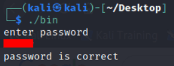

### Update (March 2023) - **Task files** and **flags** are now provided below, since the **Reverse Engineering room** has become private on TryHackMe.

| Task File | Flag |
| :-: | :-: |
| [crackme1](files/crackme1.bin) | `hax0r` |
| [crackme2](files/crackme2.bin) | `4988` |
| [crackme3](files/crackme3.bin) | `azt` |

---

**Hello and welcome!**

Before we begin, a quick heads up that we will be reversing mainly on [**Radare2**](https://github.com/radareorg/radare2#installation), so get yours ready if you haven’t already had one! Otherwise, feel free to use any disassemblers of your choice!

Here’s the link to the [**Reverse Engineering room**](https://tryhackme.com/room/reverseengineering) on Try Hack Me, which is what we’ll be focusing on later on. Also, consider starting with the much more beginner friendly [**Reversing ELF room**](https://tryhackme.com/room/reverselfiles) if you’re new to reversing!

**With that said, let’s begin!**

---

## **Crackme1**

> *This first crackme file will give you an introduction to if statements and basic function calling in assembly.*

With `test` provided to the password prompt, the binary returns a string of `password is incorrect`.

---

Disassembling `crackme1.bin` with Radare2.

---

Running `aaa` command to analyze all functions within the binary.

---

`afll` to list out details of all functions. We’ll first start with disassembling of the `main` function.

---

`pdf @main` to disassemble the main function. By this point you should be able to spot the flag pretty easily already.

Now that we’ve obtained the flag, let’s try diving a little deeper and get a better understanding of those assembly instructions!

---

From what we could observe, there seems to be **8 important segments of code**. Their explanations are as following:

1. Print `enter password` string.
2. Store the flag into `var_14h`.
3. Load the address of `var_eh` into `rax`, then copies it to `rsi`, such that `rsi` would have the address of `var_eh`. Also load an address in the memory which contains `%s` into `rdi`. 
   
   These two arguments, `rsi` and `rdi` will be used as parameters for the calling of `scanf()` in **4th segment**.
4. Calling of `scanf()`.
   - `rdi` which holds `%s`, tells `scanf()` it should expect a string input.
   - `rsi` which holds memory address of `var_eh`, tells `scanf()` where to store the string input.
5. Consist of the following operations.
   1. Load the address of `var_14h` into `rdx`, then copies it to `rsi`.
   2. Load the address of `var_eh` into `rax`, then copies it to `rdi`.
   3. In a sense, `rsi` would contain address of **the flag**, `rdi` would contain address of **our string input**. They will be used as parameters for calling of `strcmp()`.
   4. `eax` will be used to store the return value of `strcmp()`.
      - `0` is returned by `strcmp()` if both strings are **equal**.
      - `Non-zero value` is returned by `strcmp()` if both strings are **not equal**.
6. Copy `eax` to `var_18h`, then compare it against `0`. 
   
   Jump to **8th segment** if they aren’t equal, otherwise proceed to **7th segment**.
7. Print `password is correct`.
8. Print `password is incorrect`.

**Feel free to take a moment to digest/understand all these steps!**

---

Flag verification.

---

## **Crackme2**

> *This is the second crackme file — Unlike the first file, this will involve examining registers, how and where values are compared*

Nothing too special, this is done mostly to observe how the strings correlates with behavior of the binary.

---

Disassembling `crackme2.bin` with Radare2.

---

`aaa` to analyze all functions within the binary.

---

`afll` to list out details of all functions. Again, we’ll first start with disassembling of the `main` function.

---

Unlike the previous crackme, there seems to be no obvious sign of flags in this one. But one thing for sure, we are trying to get the code in the **5th segment** to execute. So, let’s begin with another round of analysis.

1. Print `enter your password` string.
2. Load the address of `var_ch` into `rax`, then copies it to `rsi`, such that `rsi` would have the address of `var_ch`. 
   Also loads an address in the memory which holds `%d` into `rdi`. 
   
   These two arguments, `rsi` and `rdi` will be used as parameters for the calling of `scanf()` in **3rd segment**.
3. Calling of `scanf()`.
   - `rdi` which holds `%d` tells `scanf()` it should expect a decimal integer input
   - `rsi` which holds memory address of `var_ch` tells `scanf()` where to store the string input.
4. Copy the value of `var_ch` *(our decimal integer input!)* to `eax`, then compare it against **a hex value**. 
   Jump to **6th segment** if they aren’t equal, otherwise proceed to **5th segment**. 
   
   ***As such, the hex value should be our flag!***
5. Print `password is valid`.
6. Print `password is incorrect`.

Overall, the assembly code of crackme2 is more straight-forward in comparison to crackme1.

---

Flag verification.

---

## **Crackme3**

> *This crackme will be significantly more challenging — it involves learning how loops work, and how they are represented in assembly*

Unlike the previous ones, the third challenge will require us to carry over what we’ve learned earlier, and observe how they are incorporated into loops.

---

Cool, got our good old `password is incorrect`.

---

Disassembling `crackme3.bin` with Radare2.

---

`aaa` to analyze all functions within the binary.

---

`afll` to list out details of all functions. Let’s start disassembling the `main` function.

---

Looks like we’ve got something interesting going on in the middle. Let’s switch over to graph view to get a better view.

---

- `sf main` to seek to address of main function. 
- `VV` to switch to visual mode and view graphs.

---

Some rough explanations:

1. Takes in our input, also initiates the loop counter to `0`.
2. Condition check for the loop, goes to **3rd segment** *(flag checking)* if the loop counter is less than or equal to `2`, otherwise proceed to **5th segment**.
3. Flag checking operation, compares our input one character at a time against the flag. 
   
   Goes to **4th segment** *(counter increment)* if they match, otherwise proceed to **6th segment**.
4. Increment loop counter by `1`.
5. Print `password is correct`.
6. Print `password is incorrect`.

**Thus, our goal is to figure out the input needed for crackme3 to execute in the following order!** 
`1234 → 234 → 234 → 25`

---

There are lots of methods to go about obtaining the flag, but the easiest way should be observing **how our input affects the highlighted instruction** in the figure above, as it directly decides if the loop counter should be incremented *(which we obviously want it to)*.

---

Press `q` 2 times to return to CLI interface. 
`db 0x561331e0077c` to set breakpoint at the specified instruction.

We’ll try to observe how our input values affect those two registers - `dl`, `al`

---

1. `dc` to start start/continue execution.
2. We’ll provide an input of `ABCD` *(0x41, 0x42, 0x43, 0x44)*, just because they are easier to spot in the memory.
3. `dr` to show value stored in registers. As a side note, `dl` is the lowest 8 bit of `rdx`, `al` is the lowest 8 bit of `rax`.

Interesting... It seems that `rdx` holds the hex value from **the first character (A)** of our input string. Furthermore, it is being compared against `rax`, `0x00000061`, which means...

***The first character of our flag is an `a`!***

Feel free to take a moment to understand how/why it is so.

Got it? We’ll modify the value of the `rdx` register to match `rax` before continuing execution, so that the loop doesn’t break.

---

Hit our second breakpoint, same concept as before, we’ll modify `rdx` register to match `rax`, the second character of the flag - `z`.

---

Last character of the flag.

---

***Voila!***

---

## **Afterthoughts**

Overall, the Reverse Engineering room was a decent learning experience for myself on the following concepts of assembly language:

- Conditional statements
- Values comparison
- Loops

I’ve had a good amount of eureka moments throughout these crackmes and they were truly amazing!