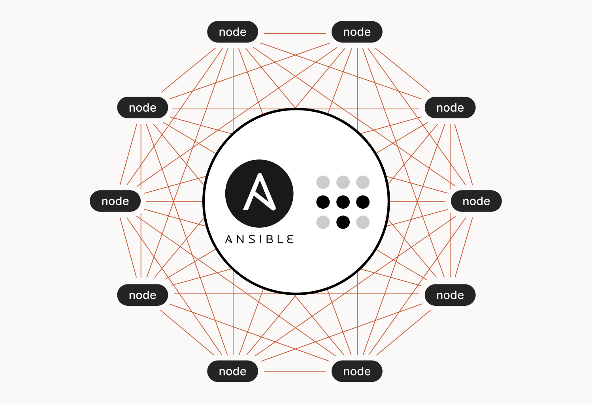

## Pre-requisites

The following components are required to proceed with this guide.

- One Ansible control node
- One or more Ansible managed nodes

For ease of understanding, this playbook has been divided into 4 sections.

---

## Section I - Defining scope of execution

```yml
- hosts: all
  become: true
```

- `hosts` - Target nodes for this playbook.
- `become` - Execute this playbook with elevated privilege. By default, `sudo` is used to become the `root` user, [*reference*](https://docs.ansible.com/ansible/latest/playbook_guide/playbooks_privilege_escalation.html#become-directives).

---

## Section II - Download Tailscale GPG key and repository

```yml
tasks:
  - name: Download Tailscale GPG key
    get_url:
      url: https://pkgs.tailscale.com/stable/ubuntu/{{ ansible_lsb.codename }}.noarmor.gpg
      dest: /usr/share/keyrings/tailscale-archive-keyring.gpg
      checksum: sha256:3e03dacf222698c60b8e2f990b809ca1b3e104de127767864284e6c228f1fb39

  - name: Download Tailscale repository
    get_url:
      url: https://pkgs.tailscale.com/stable/ubuntu/{{ ansible_lsb.codename }}.tailscale-keyring.list
      dest: /etc/apt/sources.list.d/tailscale.list
      checksum: sha256:e0acc200aebb45a3d67b4b66524100f8c1f4497866958654798fc4ba09d49f3f
```

- `get_url` - Download files from remote resource, [*reference*](https://docs.ansible.com/ansible/latest/collections/ansible/builtin/get_url_module.html).
  - `url` - Requirement as per official [*Tailscale Docs*](https://tailscale.com/download/linux/ubuntu-2204).
    - `{{ ansible_lsb.codename }}` - Leverage Ansible facts to dynamically obtain version of Ubuntu (e.g. `bionic`, `focal`, `jammy`), [*reference*](https://docs.ansible.com/ansible/latest/playbook_guide/playbooks_vars_facts.html#ansible-facts).
  - `dest` - Absolute path to download the file to, [*reference*](https://docs.ansible.com/ansible/latest/collections/ansible/builtin/get_url_module.html#parameter-dest).
  - `checksum` - SHA-256 checksum of Tailscale GPG key and repository, **makes the file download operation [idempotent](https://docs.ansible.com/ansible/latest/reference_appendices/glossary.html#term-Idempotency)**, [*reference*](https://docs.ansible.com/ansible/latest/collections/ansible/builtin/get_url_module.html#parameter-checksum).

---

## Section III - Install Tailscale

```yml
- name: Install Tailscale
  apt:
    name:
      - tailscale
    state: latest
    update_cache: true
```

- `apt` - Manage apt packages, [*reference*](https://docs.ansible.com/ansible/latest/collections/ansible/builtin/apt_module.html).
  - `name` - List of packages to be installed, [*reference*](https://docs.ansible.com/ansible/latest/collections/ansible/builtin/apt_module.html#parameter-name).
    - `tailscale` - `tailscale` will be installed.
  - `state` - Desired state of packages, [*reference*](https://docs.ansible.com/ansible/latest/collections/ansible/builtin/apt_module.html#parameter-state).
  - `update_cache` - Equivalent to running `apt-get update` before packages installation, [*reference*](https://docs.ansible.com/ansible/latest/collections/ansible/builtin/apt_module.html#parameter-update_cache).

---

## Section IV - Connect to Tailscale network

```yml
- name: Connect to Tailscale network
  command: tailscale up --authkey tskey-your-auth-key
```

- `command` - Command to be executed, [*reference*](https://docs.ansible.com/ansible/latest/collections/ansible/builtin/command_module.html#parameter-cmd). 

Additional information - Be sure to use secrets management system of some sort (e.g. Ansible Vault / HashiCorp Vault) to handle your Tailscale auth key! It's never a good idea to store secrets as plaintext in playbooks!

---

## Wrapping up - playbook recap

Feel free to adapt this playbook to fit your environment/needs!

```yml
- hosts: all
  become: true

  tasks:
    - name: Download Tailscale GPG key
      get_url:
        url: https://pkgs.tailscale.com/stable/ubuntu/{{ ansible_lsb.codename }}.noarmor.gpg
        dest: /usr/share/keyrings/tailscale-archive-keyring.gpg
        checksum: sha256:3e03dacf222698c60b8e2f990b809ca1b3e104de127767864284e6c228f1fb39

    - name: Download Tailscale repository
      get_url:
        url: https://pkgs.tailscale.com/stable/ubuntu/{{ ansible_lsb.codename }}.tailscale-keyring.list
        dest: /etc/apt/sources.list.d/tailscale.list
        checksum: sha256:e0acc200aebb45a3d67b4b66524100f8c1f4497866958654798fc4ba09d49f3f

    - name: Install Tailscale
      apt:
        name:
          - tailscale
        state: latest
        update_cache: true

    - name: Connect to Tailscale network
      command: tailscale up --authkey tskey-your-auth-key
```